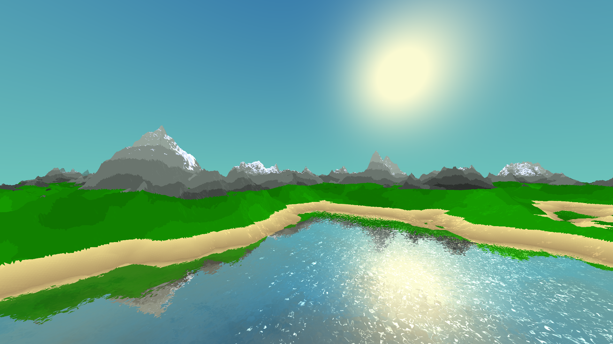
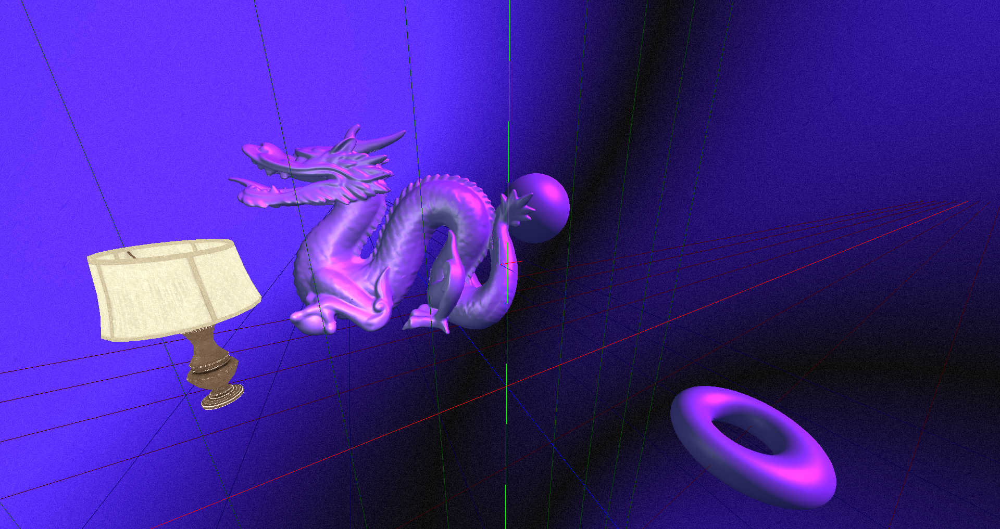
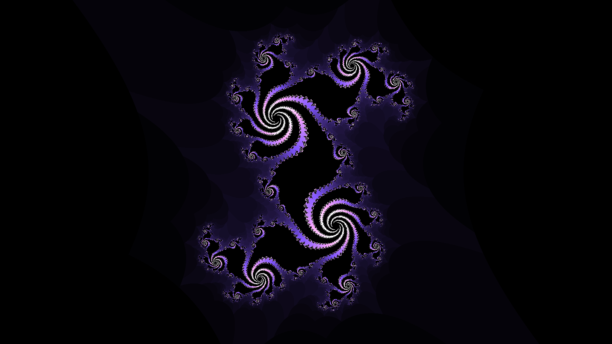
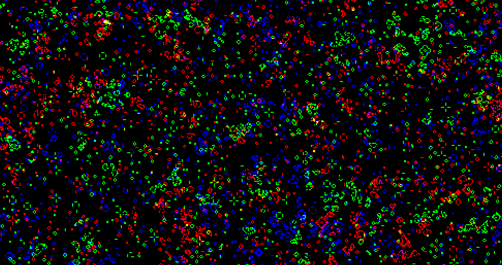
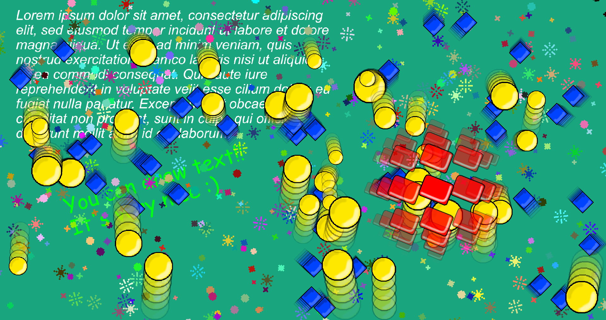

# TrippyGL

A simple and lightweight, yet highly versatile OpenGL graphics library built on top of [Silk.NET](https://github.com/Ultz/Silk.NET/).

TrippyGL is built for .NET Standard 2.1, which means you can run this on any .NET Standard 2.1 compliant platform such as .NET Core!

Targets OpenGL 3.0 and up.

The TrippyGL.ImageSharp project provides integration with [ImageSharp](https://github.com/SixLabors/ImageSharp) for easy texture loading and saving.

For windowing and input, the [Silk.NET.Windowing](https://www.nuget.org/packages/Silk.NET.Windowing) and [Silk.NET.Input](https://www.nuget.org/packages/Silk.NET.Input) packages can be used.

## Need Help?
Feel free to come ask questions over at the [TrippyGL Discord server](https://discord.gg/3j5Q4zN)!

## Gallery

